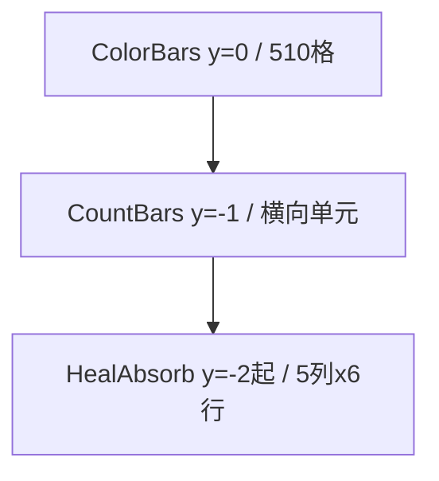
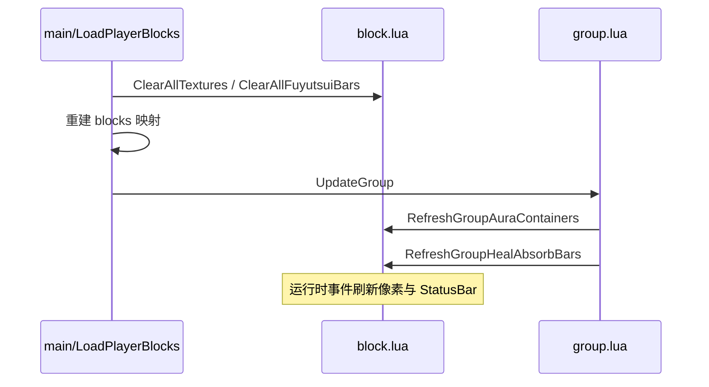

# Fuyutsui `core/block.lua`：AI 技术参考

> 本文描述插件如何把游戏状态画成屏幕顶部像素 / StatusBar，供外部程序读色。  
> 改 `block.lua` 或解读屏幕协议时，优先读本文；ClassBlocks 索引分配见 `TEXTURE_LAYOUT_zh-CN.md`；AuraContainer API 细节见 `AuraContainer_AI_Reference_zh-CN.md`。

## 0. 一句话定义

`block.lua` 负责三层屏幕输出：

| 层 | 容器名 | 屏幕位置（TOPLEFT） | 用途 |
|---|---|---|---|
| 主色块 | `FuyutsuiColorBars` | `y=0` | 510 格业务像素（状态/冷却/队伍等） |
| 横向计数条 | `FuyutsuiCountBars` | `y=-BLOCK_HEIGHT` | 充能、`castCount`、玩家光环 `maxApps` |
| 治疗吸收网格 | `FuyutsuiHealAbsorbBars` | `y=-(BLOCK_HEIGHT+BAR_HEIGHT)` | 最多 30 个队伍单位治疗吸收 |

外部程序扫描这几行像素；插件侧**不要**在战斗里对 secret 生命/吸收做算术，横向吸收条走 `UnitHealPredictionCalculator` 直通 `StatusBar:SetValue`。

## 1. AI 必须遵守的规则

1. **公开写像素 API 只有** `Fuyutsui:CreateTexture(index, b)`；业务值进蓝通道 `b`（通常已归一化到 `0..1`）。
2. **不要**格式化整个 `block.lua`；配置常量集中在文件顶部，改尺寸先改顶部常量。
3. **主色块索引**由 `main.lua:LoadPlayerBlocks` 分配；`block.lua` 只负责按索引画色，不负责语义命名。
4. **CountBars 背景编码**与 **HealAbsorb 编码不同**，禁止混用。
5. `GetHealAbsorbs()` 返回 `amount, clamped`；`SetValue` 只能传第一个返回值，否则 `clamped` 会进 `interpolation` 并报 secret 错。
6. 专精/天赋切换会调 `ClearAllFuyutsuiBars()`；会连带清理玩家/队伍 AuraContainer 与治疗吸收绑定。
7. 队伍吸收条单位列表来自 `Fuyutsui.groupList`（`UpdateGroup`）；只显示已检测到的单位槽。
8. Aura 像素槽不要自己轮询 `C_UnitAuras`；用 AuraContainer 回调画色。
9. 保持 Lua 5.1 / WoW 兼容写法。

## 2. 屏幕纵向布局

```text
y =  0   FuyutsuiColorBars     高度 BLOCK_HEIGHT(=1)
y = -1   FuyutsuiCountBars     内容行高度 BAR_HEIGHT(=1)；容器高 BAR_FRAME_HEIGHT(=20)
y = -2   FuyutsuiHealAbsorbBars 第 1 行
y = -3   …第 2 行
…
y = -7   …第 6 行（最多）
```



## 3. 可修改配置（文件顶部）

| 常量 | 默认 | 作用 |
|---|---:|---|
| `BLOCK_FIX_COUNT` | 510 | 主色块总数 |
| `BLOCK_FIRST_SCHEME_MAX` | 255 | 索引分界：之后换 r 方案 |
| `BLOCK_HEIGHT` | 1 | 主色块高度 |
| `BLOCK_SPACING` | 0 | 主色块间距 |
| `BAR_UNIT_COUNT` | 500 | CountBars 横向逻辑单元数 |
| `BAR_HEIGHT` | 1 | CountBars **与** HealAbsorb 行高（共用） |
| `BAR_FRAME_HEIGHT` | 20 | CountBars 容器高度 |
| `BAR_START_INDEX` | 2 | 第一条 CountBar 起始逻辑单元 |
| `BAR_END_COLOR` | `(200,200,200)/255` | CountBars 全部条之后的终点色块 |
| `BAR_STATUS_LEVEL` | 4999 | StatusBar frame level |
| `HEAL_ABSORB_MAX_SLOTS` | 30 | 吸收条最大槽位数 |
| `HEAL_ABSORB_COLS` | 5 | 每行列数 |
| `HEAL_ABSORB_BAR_UNITS` | 100 | 单条条身单元数 |
| `HEAL_ABSORB_SLOT_UNITS` | 102 | 前锚点 1 + 条身 100 + 终点 1 |

派生：

- 主色块宽 = `screenWidth / 510`
- CountBars 单元宽 = `screenWidth / 500`
- HealAbsorb 列起点步进 = `102 * (screenWidth/500)`（5 列约 510 单元）

## 4. 主色块 `FuyutsuiColorBars`

### 4.1 编码

`CreateTexture(index, b)` → `SetColorTexture(r, g, b, 1)`：

| 索引范围 | r | g | b |
|---|---|---|---|
| `1..255` | `0` | `index/255` | 业务值 |
| `256..510` | `1/255` | `(index-255)/255` | 业务值 |

外部反解：先用 `r` 判断方案，再用 `g` 还原索引，读 `b` 得业务值。

### 4.2 公开 API

```lua
Fuyutsui:CreateTexture(i, b)   -- 写第 i 格蓝通道
Fuyutsui:ClearAllTextures()  -- 全部 b=0
```

加载时预创建全部 510 格纹理。

### 4.3 谁写入主色块

| 来源 | 方式 |
|---|---|
| 状态块 | `UpdateStateBlock` → `CreateTexture` |
| 法术冷却 | `UpdateSpellCooldown` → `CreateTexture` |
| 队伍血量/角色 | `group.lua` → `CreateTexture` |
| 单位光环剩余 | AuraContainer DurationText 曲线（同索引 r/g，b 随剩余时间） |
| 队伍驱散 | AuraContainer 驱散纹理蓝通道（Magic=1…Bleed=11）/255 |

索引语义映射在 `Fuyutsui.blocks`，由 `LoadPlayerBlocks` 生成，**不要**在 `block.lua` 写死职业索引。

## 5. 横向计数条 `FuyutsuiCountBars`

### 5.1 职责

- `CreateAutoLayoutBar(valueType, minValue, maxValue, spellId)`：`castCount` / `charge`
- `LayoutAuraApplicationBars()`：玩家光环 `maxApps` 层数条（AuraContainer StatusBar）
- 排布顺序：计数条 → 光环层数条 → `BAR_END_COLOR` 终点

### 5.2 空间步进

单条预留：`maxValue + 3`（背景 `[-1..max]` + 终点预留 + 间隔）。  
`ReserveHorizontalBarUnits` 失败则 `print` 警告并返回 `nil`。

### 5.3 背景锚点编码（定位条段）

`CreateHorizontalBarBackgrounds(startIndex, maxValue)` 对 `i = -1 .. maxValue`：

```text
颜色 = (r=1/255, g=(i+1)/255, b=0)
屏幕 x = (startIndex + i - 1) * unitWidth
```

| i | 相对索引 `i+1` | 含义 |
|---:|---:|---|
| -1 | 0 | 条前一格 |
| 0 | 1 | StatusBar 起点对齐 |
| 1..N | 2..N+1 | 条身单元 |

StatusBar：白色 `ChatFrameBackground`，锚在 `(startIndex-1)*unitWidth`，宽 `maxValue*unitWidth+1`。

终点色块：全部条排完后移到 `nextAvailableIndex - 2`，颜色 `BAR_END_COLOR`。

### 5.4 公开 API

```lua
Fuyutsui:CreateAutoLayoutBar(valueType, minValue, maxValue, spellId)
Fuyutsui:LayoutAuraApplicationBars()
Fuyutsui:ClearAllFuyutsuiBars()  -- 清 CountBars + Aura + HealAbsorb 绑定
```

同一 `spellId` 只创建一次横向条。

## 6. 队伍治疗吸收条 `FuyutsuiHealAbsorbBars`

### 6.1 网格

- 槽位 `1..30`；`row = floor((slot-1)/5)`，`col = (slot-1)%5`（0-based）
- 仅绑定 `groupList` 前 `min(#list, 30)` 个单位；其余整槽 `Hide`
- 每槽子 Frame：前锚点 1 + 条身 100 + 终点色块 1（`BAR_END_COLOR`）

### 6.2 编码（与 CountBars 不同）

**行 r（0-based）**：第 1 行 `r=0` … 第 6 行 `r=5`。同行条身背景 r 统一。

**前锚点（1 格）**：

```text
(r = row/255, g = unitValue/255, b = 0)
```

| unit | g 通道整数值 |
|---|---:|
| `player` | 1 |
| `party1`..`party4` | 2..5 |
| `raidN` | N |

**条身背景**：`(r=row/255, g=i/255, b=unitValue/255)`，`i=1..100`。  
**白色 StatusBar**：盖在条身上，表示治疗吸收量 / 最大生命。  
**终点色块（条右侧 1 格）**：`BAR_END_COLOR = (200,200,200)/255`，与 CountBars 终点相同。

### 6.3 刷新（秘密值安全）

```lua
UnitGetDetailedHealPrediction(unit, nil, calculator)
local amount = calculator:GetHealAbsorbs()  -- 只要第一个返回值
bar:SetMinMaxValues(0, calculator:GetMaximumHealth())
bar:SetValue(amount)
```

禁止对 health/absorb 做加减。吸收 > 最大生命时 StatusBar 只填满，不撑破框架。

### 6.4 公开 API 与调用链

```lua
Fuyutsui:RefreshGroupHealAbsorbBars()   -- UpdateGroup 末尾调用
Fuyutsui:UpdateGroupHealAbsorbBar(unit) -- UNIT_* 事件
Fuyutsui:ClearGroupHealAbsorbBars()     -- ClearAllFuyutsuiBars 内调用
```

事件（容器级）：`UNIT_HEALTH` / `UNIT_MAXHEALTH` / `UNIT_HEAL_PREDICTION` / `UNIT_HEAL_ABSORB_AMOUNT_CHANGED`。

## 7. AuraContainer 集成（本文件内）

详细 API 见 `AuraContainer_AI_Reference_zh-CN.md`。本文件约定：

### 7.1 单位光环持续时间像素（主色块行）

- 每索引一对槽：`_timed_`（限时，`maxDuration` 大上限）+ `_permanent_`（永久）
- 限时：底层 `b=0`，`█` DurationText 用颜色曲线，剩余 0..255 秒映射蓝通道
- 永久：底层 `b=1`
- 曲线 r/g 与 `CreateTexture` 同索引编码一致

### 7.2 反应过滤

敌对单位上 `HELPFUL`、友方上 `HARMFUL` 会忽略 `includeSpellIDs`；用 `IsAuraFilterAllowedForUnit` + `ApplyUnitAuraReactionFilters`，非法时用 `maxDuration=0` 空过滤器。

### 7.3 玩家层数条

仅 `auras.player` 且带 `maxApps`；与 CountBars 共用 `ReserveHorizontalBarUnits` / 背景编码。

### 7.4 队伍成员光环

```text
pixel = groups.start + (memberIndex-1)*groups.num + offset
```

- `groups.aura[offset]`：HELPFUL 剩余时间色块  
- `groups.dispel`：HARMFUL 可驱散类型；蓝通道 Magic=1 Curse=2 Disease=3 Poison=4 Bleed=11  

`RefreshGroupAuraContainers()` 在 `UpdateGroup` 中调用。

### 7.5 相关公开 API

```lua
Fuyutsui:RefreshPlayerAuraContainers()
Fuyutsui:RefreshUnitAuraContainers()
Fuyutsui:UpdateUnitAuraContainer(unit)
Fuyutsui:ReleasePlayerAuraContainers()
Fuyutsui:ReleaseUnitAuraContainers()
Fuyutsui:RefreshGroupAuraContainers()
Fuyutsui:ReleaseGroupAuraContainers()
Fuyutsui:LayoutAuraApplicationBars()
```

## 8. 生命周期



专精切换：`ClearAllFuyutsuiBars` → 延迟 `UpdatePlayerSpecInfo` → 再 `UpdateGroup`。

## 9. 外部读色速查

| 扫描行 | 识别 | 读什么 |
|---|---|---|
| y≈0 主色块 | r=0 或 r=1；g→索引 | b=业务值；光环可能由 █ 叠色 |
| y≈-1 CountBars | 背景 r=1 | g=条内相对索引；白条=层数/充能 |
| y≈-2..-7 HealAbsorb | 行首锚点 r=行号 | 锚点 g=单位编号；条身 b=单位编号；白条=吸收比例 |

反解整型通道：`round(channel * 255)`（注意截图/缩放误差）。

## 10. 常见改动清单

| 需求 | 改哪里 |
|---|---|
| 主色块高度 | `BLOCK_HEIGHT`（会带动 CountBars / HealAbsorb 的 y 偏移） |
| 只改横向条高度 | 现状与 HealAbsorb 共用 `BAR_HEIGHT`；若要分离需新增常量 |
| 吸收条长度/列数 | `HEAL_ABSORB_BAR_UNITS` / `HEAL_ABSORB_COLS` / `HEAL_ABSORB_MAX_SLOTS` |
| 吸收条单位编号规则 | `GetHealAbsorbUnitValue` |
| 新增横向条类型 | `CreateAutoLayoutBar` + `main.lua` bars 表 |
| 新增主色块语义 | `class/*.lua` ClassBlocks + 必要时 `stateblocks.lua` getter |

## 11. 反模式（不要做）

- 对 `GetCurrentHealth` / `GetHealAbsorbs` 结果做 `+` `-` `*` `/` 或比较分支（secret）。
- `bar:SetValue(calculator:GetHealAbsorbs())` 未拆返回值。
- 给 HealAbsorb 背景继续用 CountBars 的固定 `r=1/255`。
- 在 `block.lua` 里写死某职业像素索引。
- 战斗中重建需要 `InCombatLockdown` 保护的安全按钮（本文件主要是显示层，但仍勿引入安全动作）。
- 对已注册 AuraButton 子对象 `SetParent`。

## 12. 关键文件

| 文件 | 关系 |
|---|---|
| `main.lua` | `LoadPlayerBlocks` 分配索引；创建 bars；触发 group 刷新 |
| `core/group.lua` | `UpdateGroup` → 光环容器 + 吸收条 |
| `core/stateblocks.lua` | 状态名 → getter → `CreateTexture` |
| `core/player.lua` / `events.lua` | 专精切换清理与重建 |
| `TEXTURE_LAYOUT_zh-CN.md` | ClassBlocks → 索引顺序 |
| `AuraContainer_AI_Reference_zh-CN.md` | AuraContainer 原生 API |

## 13. 验证建议

1. `/reload` 后确认三行容器存在且 y 不重叠错位。  
2. 主色块：改已知状态，读 `CreateTexture` 对应格 b。  
3. CountBars：有充能技能时白条长度与背景相对索引对齐。  
4. HealAbsorb：小队中用 `test/GetRGB.py` 点条前锚点，核对 `r=行号`、`g=单位编号`。  
5. 进出队伍：未在 `groupList` 的槽应整槽隐藏。  
6. 切换专精：横向条与吸收绑定被清后重建，无 Lua 报错。
