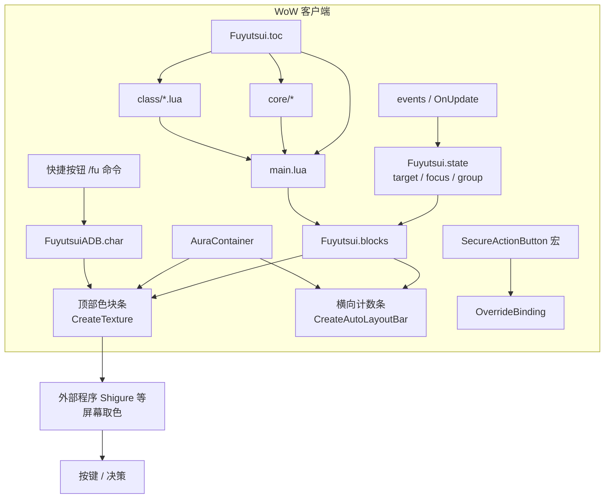
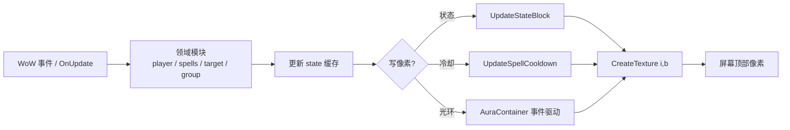
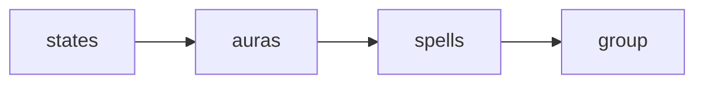
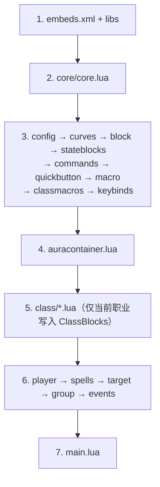

# Fuyutsui

World of Warcraft Retail Lua AddOn。在屏幕顶部绘制 **510** 个极窄色块，把玩家、目标、队伍、光环、法术冷却、配置开关等游戏状态编码成像素颜色，供外部程序（如 [Shigure](https://github.com/waynebian01/Shigure)）读取。

| 项目 | 说明 |
| --- | --- |
| 版本 | 见 `Fuyutsui.toc`（当前 `1.2.1`） |
| 接口 | Retail（`Interface` 120000+） |
| 作者 | Wayne Bian |
| 存档 | `FuyutsuiADB`（SavedVariables） |
| 命令 | `/fu`、`/fuyutsui` |

> 旁白：Fuyutsui Tinkerer——冬月电子出品的网络接入仓。别让荒坂发现。

---

# 免责声明 (Disclaimer)

   1. 法律合规性

      本软件（以下简称“Fuyutsui”）仅供技术研究、学术交流及个人学习之用。用户在下载、安装或使用本软件前，必须自行确保其行为符合所在地法律法规及相关服务提供商（包括但不限于游戏运营商）的用户协议与服务条款。

   2. 封号与处罚风险

      用户应明确了解：使用第三方辅助工具或自动化脚本可能被游戏反作弊系统检测。由此导致的账号受限、角色封禁、数据丢失或任何其他形式的处罚，其后果由用户自行承担。开发者不对任何因使用本软件产生的负面后果承担法律或经济责任。

   3. 软件可靠性

      本软件基于 MIT 许可证分发，按“原样”（As Is）提供。开发者不就软件的稳定性、完整性、安全性或特定用途的适用性做出任何明示或暗示的保证。因软件存在缺陷、漏洞或兼容性问题而导致的任何直接或间接损失，开发者概不负责。

   4. 商业行为之独立责任声明

      鉴于本软件采用 MIT 许可证开源，任何人均有权在许可范围内进行复制、修改或分发。但开发者在此特别声明：开发者不鼓励、亦不赞同任何违反游戏运营商服务条款的商业营利行为（如收费代练、打包作为付费外挂销售等）。

      任何组织或个人若将本软件（或其衍生版本）用于商业用途，由此引发的所有法律纠纷、知识产权侵权责任、游戏官方追责及封号赔偿损失，均由该商业实施方独立承担完全责任。本软件开发者不参与任何商业运营，亦不承担任何连带责任。

   5. 最终解释权

      开发者保留随时修改本免责声明及项目源代码的权利。一旦开始使用本软件，即视为用户已阅读并完全同意本声明的所有条款。

---

## 它做什么

- 在屏幕最顶端生成主色块条（510 格）+ 下方横向计数条（充能 / `castCount` / 光环层数）。
- 按当前职业与专精加载 `ClassBlocks`，把状态、光环、法术冷却、队伍信息映射到固定像素索引。
- 通过 SecureActionButton 创建宏并绑定预设键位；扫描动作条，建立 `spellId → key/keycode` 映射。
- 提供斜杠命令与游戏内快捷按钮，切换爆发、AOE/单体、输出模式、药水等角色级开关。

本插件**只负责游戏内状态编码与宏绑定**；热键触发、决策执行由外部读取端完成。

---

## 系统拓扑



### 数据流（运行时）



### 主色块索引分配

同一专精内从索引 **1** 起连续占位，顺序固定：



| 区域 | 容器 | 用途 |
| --- | --- | --- |
| 主色块条 | `FuyutsuiColorBars`（屏幕最顶端） | 状态、光环剩余、法术冷却、队伍等，按整数索引从左到右 |
| 横向计数条 | `FuyutsuiCountBars`（紧贴下方） | 充能、`castCount`、光环 `maxApps`；**不占用**主色块索引 |

像素编码约定：

- 索引 `1..255`：`r=0`，`g=index/255`，业务值在 `b`
- 索引 `256..510`：`r=1/255`，`g=(index-255)/255`，业务值在 `b`

不同职业/专精声明的条目数量不同，**同一语义的绝对索引可能不同**。

---

## 仓库结构

```text
Fuyutsui/
├── Fuyutsui.toc          # 入口与加载顺序
├── embeds.xml / libs/    # LibStub、LibRangeCheck-3.0
├── main.lua              # LoadPlayerBlocks / LoadPlayerMacros 编排
├── auracontainer.lua     # 中央 buff 演示 UI（与像素协议无关）
├── Keymap.md             # 键位编码对照
├── core/
│   ├── core.lua          # 全局 Fuyutsui、事件框架、SavedVariables
│   ├── config.lua        # 静态配置：法术、难度、键位、动作条…
│   ├── curves.lua        # 颜色 / 能量曲线
│   ├── block.lua         # 色块条 + CreateTexture / 计数条
│   ├── stateblocks.lua   # 状态块 getter → UpdateStateBlock
│   ├── commands.lua      # /fu 斜杠命令
│   ├── quickbutton.lua   # 游戏内快捷切换按钮
│   ├── macro.lua         # SecureActionButton 宏绑定
│   ├── classmacros.lua   # 全职业宏表
│   ├── keybinds.lua      # 动作条 spellId → 键位扫描
│   ├── player.lua        # 玩家状态
│   ├── spells.lua        # 法术冷却
│   ├── target.lua        # 目标 / 焦点
│   ├── group.lua         # 队伍
│   └── events.lua        # 事件与 OnUpdate 刷新节奏
└── class/*.lua           # 各职业 ClassBlocks（仅当前职业生效）
```

### 加载顺序



新增 Lua 文件时必须同步 `Fuyutsui.toc`。

---

## 刷新节奏

| 频率 | 内容 |
| --- | --- |
| 每帧 | 玩家施法/引导/蓄力、目标/焦点施法、队伍血量范围 |
| 每 0.2 秒 | 法术冷却、玩家辅助、符文、目标距离、敌人数、物品冷却 |
| 每 1 秒 | 战斗时间、天启骑士数量等 |
| 事件驱动 | 玩家/队伍光环像素（AuraContainer，不在 OnUpdate 轮询） |

---

## 安装

将本仓库文件夹放到：

```text
...\World of Warcraft\_retail_\Interface\AddOns\Fuyutsui\
```

1. 启动游戏 → Esc → 插件 → 勾选 **Fuyutsui**
2. 更新文件后在聊天框输入 `/reload`
3. 完整键位编码见 [Keymap.md](Keymap.md)

---

## 游戏内命令

| 命令 | 说明 |
| --- | --- |
| `/fu` / `/fu help` | 命令帮助 |
| `/fu cd` / `on` / `off` | 爆发开关 |
| `/fu aoemode` / `auto` / `aoe` | AOE / 单体模式 |
| `/fu dpsmode` / `manual` / `assistant` | 手写逻辑 / 官方一键辅助 |
| `/fu potion` / `on` / `off` | 爆发药水开关 |
| `/fu delay [秒]` | 临时 delay 标志（默认 1 秒） |

配置按角色保存在 `FuyutsuiADB`；亦可用屏幕上的快捷按钮切换爆发、AOE、输出模式、药水。

---


## 相关文档

| 文档 | 内容 |
| --- | --- |
| [Keymap.md](Keymap.md) | 热键 ID ↔ 按键对照 |

---

## License

MIT。使用前请完整阅读上方免责声明。
