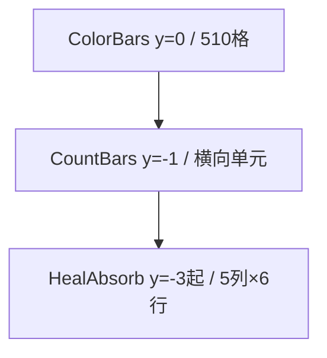
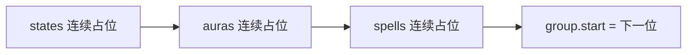

# 纹理排序说明

本文描述 Fuyutsui 如何把 `ClassBlocks` 映射到屏幕上的色块 / 横向条，以及外部读取时应按什么顺序理解这些纹理。

- 实现入口：`main.lua` 的 `Fuyutsui:LoadPlayerBlocks(specIndex)`
- 主色块写入：`Fuyutsui:CreateTexture(index, b)`（`core/block.lua`）
- 像素编码与容器细节：见 `BLOCK_AI_Reference_zh-CN.md`

---

## 1. 三行输出区域

| 区域 | 容器 | 屏幕 y（TOPLEFT） | 用途 |
| --- | --- | --- | --- |
| 主色块条 | `FuyutsuiColorBars` | `0` | 状态、光环剩余、法术冷却、队伍成员等，按 **整数索引** 从左到右排布 |
| 横向计数条 | `FuyutsuiCountBars` | `-BLOCK_HEIGHT`（默认 `-1`） | 充能层数、`castCount`、光环 `maxApps` 层数条；**不占用**主色块索引 |
| 治疗吸收网格 | `FuyutsuiHealAbsorbBars` | `-(BLOCK_HEIGHT+BAR_HEIGHT)`（默认 `-3`） | 队伍单位治疗吸收；**不占用**主色块索引，也不参与 CountBars 排布 |

当前尺寸常量（`core/block.lua` 顶部）：

| 常量 | 默认 | 作用 |
| --- | ---: | --- |
| `BLOCK_FIX_COUNT` | 510 | 主色块总数 |
| `BLOCK_HEIGHT` | 1 | 主色块高度 |
| `BAR_HEIGHT` | 2 | CountBars 与 HealAbsorb **共用**行高 |
| `BAR_UNIT_COUNT` | 500 | CountBars / HealAbsorb 横向逻辑单元数 |

主色块索引编码：

- `1..255`：`r=0`，`g=index/255`，业务值在 `b`
- `256..510`：`r=1/255`，`g=(index-255)/255`，业务值在 `b`

```text
y =  0   ColorBars          高度 1，510 格
y = -1   CountBars          内容高度 2
y = -3   HealAbsorb 第 1 行  高度 2；最多 6 行（5 列 × 30 槽）
```



---

## 2. 主色块总排序（同一专精）

`LoadPlayerBlocks` 从索引 **1** 起连续分配，顺序固定为：

```text
states → auras → spells → group
```

没有空隙：上一段用完后，下一段紧接着递增。不同专精声明的条目数量不同，因此 **同一语义在不同职业/专精上的绝对索引可能不同**；外部程序应按「当前专精表顺序」解读，或按名称 / `spellId` 映射，而不是写死固定格位。



---

## 3. `states`：状态像素

### 3.1 分类写法（当前全部职业）

```lua
states = {
    ["状态"] = { "锚点", "职业", ..., "敌人人数" },
    ["目标"] = { "类型", "生命值", "施法", "施法可打断" },
    ["焦点"] = { ... }, -- 可选
}
```

分配顺序固定为：**状态 → 目标 → 焦点**。每项占 **1** 格。

写入 `blocks.state` 的键名规则：

| 分类 | 表内名称 | `blocks.state` 键 |
| --- | --- | --- |
| `状态` | `"生命值"` | `"生命值"` |
| `目标` | `"生命值"` | `"目标生命值"`（分类名 + 名称） |
| `焦点` | `"施法"` | `"焦点施法"` |

运行时通过 `UpdateStateBlock("目标", "生命值")` 等写入对应像素。

约定：每个专精 `["状态"]` 开头通常包含这 8 项：

| 顺序 | 名称 |
| ---: | --- |
| 1 | 锚点 |
| 2 | 职业 |
| 3 | 专精 |
| 4 | 队伍类型 |
| 5 | 英雄天赋 |
| 6 | 有效性 |
| 7 | 一键辅助 |
| 8 | 法术失败 |

其后是专精自定义状态（战斗时间、生命值、能量、敌人人数等）。

### 3.2 扁平写法（兼容）

```lua
states = {
    "锚点",
    "职业",
    -- ...
}
```

若表中 **没有** `"状态"` / `"目标"` / `"焦点"` 键，则按 `ipairs` 顺序写入 `blocks.state[名称] = index`。新职业表请用分类写法。

---

## 4. `auras`：单位光环像素

```lua
auras = {
    player = {
        { name = "黑暗主宰", spellId = 1253591 },
        { name = "圣光涌动", spellId = 114255, maxApps = 2 },
    },
    target = {
        harmful = { { name = "暗言术：痛", spellId = 589 } },   -- 敌对：HARMFUL
        helpful = { { name = "救赎", spellId = 194384 } },     -- 友善：HELPFUL
    },
    focus = {
        harmful = {},
        helpful = { { name = "真言术：盾", spellIds = { 17, 1253593 } } },
    },
}
```

分配顺序：`player` → `target.harmful` → `target.helpful` → `focus.harmful` → `focus.helpful`。

- 每条有效光环（含 `spellId` 或 `spellIds`）占主色块 **1** 格：由对应单位的 AuraContainer 刷新。
- `maxApps` **不**额外占主色块；层数条目前只排布 `player` 光环（见第 7 节）。
- 缺少 `spellId`/`spellIds` 的条目会跳过并打印警告，**不占位**。
- 兼容旧扁平数组：整表当作 `player` / `HELPFUL`。

主色块上光环剩余时间由 AuraContainer DurationText（`█`）叠色；永久光环底层 `b=1`。细节见 `BLOCK_AI_Reference_zh-CN.md` §7。

---

## 5. `spells`：法术冷却 / 充能冷却

```lua
spells = {
    { spellId = 47540, name = "苦修", charge = true, maxCharge = 2 },
}
```

按数组顺序排列；缺少 `spellId` 的条目跳过并警告。占位规则：

| 条目字段 | 主色块 | 刷新来源 |
| --- | --- | --- |
| 默认（无 `charge`） | **1** 格：技能冷却 → `blocks.spells[id].index` | `GetSpellCooldown` / `GetSpellCooldownDuration` |
| `charge = true` | **2** 格：冷却 → `.index`，充能回充 → `.charge` | 冷却同上；充能用 `GetSpellChargeDuration` |
| 另有 `maxCharge = N` | **不另占**主色块；创建横向充能层数条 `0..N` | `GetSpellCharges().currentCharges` |
| `castCount = N` | **不另占**主色块（该条本身仍按上表占 1 或 2 格）；创建横向 `castCount` 条 | `GetSpellCastCount` |

以苦修为例，一条 `charge = true, maxCharge = 2` 同时产出：

1. `.index` → **冷却**像素
2. `.charge` → **充能冷却**像素
3. `maxCharge = 2` → 横向条 **充能层数**（CountBars 行）

不要再为同一 `spellId` 写「无 charge + charge」双条目；一条带 `charge` 的即可。

可选透传：`forcedKnown`、`inSpellBook`（影响是否视为已学会，不改变占位）。

---

## 6. `group`：队伍成员块

```lua
group = {
    num = 5,              -- 每位成员占用的格数（步长）
    healthPercent = 1,    -- 相对偏移：血量
    role = 2,             -- 相对偏移：职责
    dispel = 3,           -- 可选：可驱散
    aura = {              -- 可选：成员光环，键为偏移
        [4] = { name = "救赎", spellId = 194384 },
        [5] = { name = "真言术：盾", spellIds = { 17, 1253593 } },
    },
}
```

- `group` **只声明一次**；`blocks.groups.start` = 此时下一个可用主色块索引。
- 第 `i` 名成员（`i` 从 1 起）的基址：

```text
memberBase = groups.start + (i - 1) * groups.num
pixel      = memberBase + offset
```

例如 `num = 5`，`start = 60`：

| 成员 | 血量 | 职责 | dispel | aura[4] | aura[5] |
| ---: | ---: | ---: | ---: | ---: | ---: |
| 1 | 61 | 62 | 63 | 64 | 65 |
| 2 | 66 | 67 | 68 | 69 | 70 |
| … | … | … | … | … | … |

成员数量由运行时 `groupList` 决定；配置里的 `num` 是 **每位成员的槽宽**，不是人数上限。槽位超出 510 的部分不会写出。

队伍成员光环 / 驱散由 `RefreshGroupAuraContainers()` 驱动（`UpdateGroup` 内调用）：

- `groups.aura[offset]`：HELPFUL 剩余时间色块
- `groups.dispel`：HARMFUL 可驱散类型；蓝通道 Magic=1 / Curse=2 / Disease=3 / Poison=4 / Bleed=11

---

## 7. 横向条排序（第二行 CountBars）

与主色块独立，从左到右为：

```text
spells 推导的计数条（CreateAutoLayoutBar）
  → 光环 maxApps 层数条（LayoutAuraApplicationBars）
  → BAR_END_COLOR 终点色块
```

### 7.1 由 `spells` 推导

`LoadPlayerBlocks` 生成 `blocks.bars`，`UpdatePlayerBarInfo` 调用 `CreateAutoLayoutBar`：

| 条件 | `valueType` | min | max |
| --- | --- | ---: | ---: |
| `charge = true` 且 `maxCharge = N` | `"charge"` | 0 | N |
| `castCount = N`（正数） | `"castCount"` | 0 | N |

同一 `spellId` 的横向条只创建一次。首条从逻辑单元 `BAR_START_INDEX`（默认 `2`）起排；单条步进 `max + 3`（背景 `[-1..max]` + 终点预留 + 间隔）。

背景锚点编码（定位条段）：`(r=1/255, g=相对索引/255, b=0)`。白色 StatusBar 表示当前层数 / 充能 / castCount。

### 7.2 由 `auras` 的 `maxApps` 推导

带 `maxApps` 的 **玩家**光环在主色块显示剩余时间后，再在横向条追加层数条，排在 spell 计数条之后。

---

## 8. 治疗吸收网格（第三行 HealAbsorb）

不由 `ClassBlocks` 声明；始终按 `groupList` 自动绑定，最多 **30** 槽（5 列 × 6 行）。

| 项 | 值 |
| --- | --- |
| 单槽结构 | 前锚点 1 + 条身 100 + 终点 1（共 102 逻辑单元） |
| 单位顺序 | `groupList[1..30]`；未绑定槽整槽隐藏 |
| 前锚点 | `(r=行号/255, g=单位编号/255, b=0)`；`player=1`，`party1..4=2..5`，`raidN=N` |
| 条身背景 | `(r=行号/255, g=1..100/255, b=单位编号/255)` |
| 白色 StatusBar | 治疗吸收量 / 最大生命（秘密值直通，禁止算术） |
| 终点色块 | 与 CountBars 相同的 `BAR_END_COLOR` |

刷新：`UpdateGroup` 末尾 `RefreshGroupHealAbsorbBars()`；事件侧 `UpdateGroupHealAbsorbBar(unit)`。

**注意**：HealAbsorb 的 `r` 编码与 CountBars 固定 `r=1/255` **不同**，禁止混用读色逻辑。完整约定见 `BLOCK_AI_Reference_zh-CN.md` §6。

---

## 9. 戒律牧师示意（相对顺序）

配置见 `class/Priest.lua` `[1]`。主色块从左到右概念顺序：

```text
[状态…] 锚点…敌人人数
  → [目标…] 目标类型、目标生命值、目标施法、目标施法可打断
  → [auras.player] 黑暗主宰、圣光涌动、福音、祸福相依、熵能裂隙
  → [auras.target] 暗言术：痛 → 救赎 → 真言术：盾
  → [auras.focus] 暗言术：痛 → 救赎 → 真言术：盾
  → [spells] 心灵尖啸 … 苦修(CD) → 苦修(充能CD) → 真言术：耀(CD) → 耀(充能CD) → …
  → [group] 从 start 起每位 5 格（血量/职责/驱散/救赎/盾）
```

横向条 CountBars（示例）：

```text
苦修层数(0..2) → 真言术：耀层数(0..2) → 圣光涌动层数 → 福音层数 → 祸福相依层数 → 终点色
```

其下 HealAbsorb：按当前 `groupList` 从左到右、自上而下绑定队伍单位吸收条。

具体绝对索引随 `states`/`auras`/`spells` 长度变化；以 `/reload` 后当前专精表为准。

---

## 10. 外部读取建议

1. **主色块（y≈0）**：用 `(r,g)` 还原索引，用 `b` 读业务值；光环限时可能由 `█` 叠色。先确认当前专精的 `ClassBlocks` 顺序。
2. **名称映射**：状态看 `blocks.state` 键规则（分类拼接）；法术看 `spellId` 的 `.index` / `.charge`。
3. **CountBars（y≈-1）**：用背景色 `(r=1/255, g=相对单元/255)` 定位段，再读白色 StatusBar 当前值。
4. **HealAbsorb（y≈-3 起）**：点条前锚点，`r`=行号、`g`=单位编号；白条=吸收比例。不要用 CountBars 的 `r=1/255` 规则去扫这一行。
5. **切专精 / 天赋**：插件会清空并重建映射（含 CountBars / Aura / HealAbsorb），外部缓存的绝对索引需失效重读。

反解整型通道：`round(channel * 255)`（注意截图 / 缩放误差）。

---

## 11. 相关代码

| 文件 | 职责 |
| --- | --- |
| `class/*.lua` | 声明 `states` / `auras` / `spells` / `group` |
| `main.lua` → `LoadPlayerBlocks` | 连续分配主色块索引，生成 `blocks.bars` |
| `core/spells.lua` → `UpdateSpellCooldown` | 写技能 CD / 充能 CD |
| `core/player.lua` → `UpdatePlayerBarInfo` | 创建横向计数条并布局光环层数条 |
| `core/group.lua` → `UpdateGroup` | 队伍状态 + 成员光环容器 + 吸收条刷新 |
| `core/block.lua` | `CreateTexture`、`CreateAutoLayoutBar`、AuraContainer、HealAbsorb |
| `core/stateblocks.lua` | `UpdateStateBlock` 与状态 getter |
| `BLOCK_AI_Reference_zh-CN.md` | 三行像素协议与编码细节（AI / 读色单一事实来源） |
